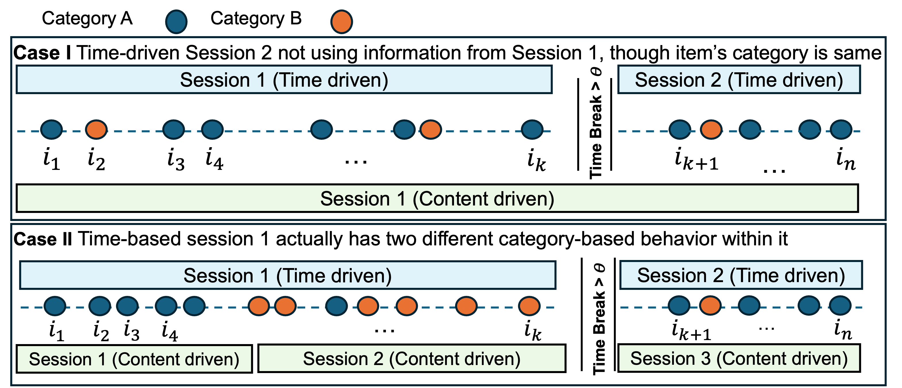
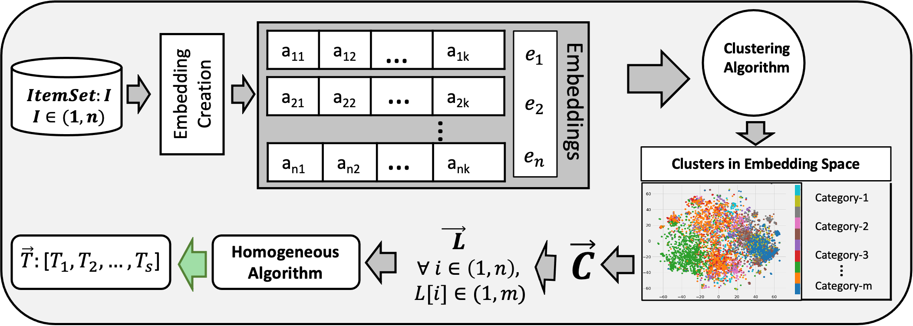

# "Ready for You When You are Back: Content-driven Session-based Recommendation for Continuity of Experience"

This is our implementation for the paper:

 
<figcaption> Fig.1: Here is the basic insight when time-driven sessions fail in capturing the patterns and Content-driven succeeds
 </figcaption>

 
<figcaption> Fig.2: Process of Homogeneous Session Creation 
 </figcaption>

## Requirements
python --> Use python 3.6.0 or newer.Python 2 is NOT supported.
numpy --> 1.15.1 or newer.
pandas --> 0.25.3 or newer.
CUDA --> Needed for the GPU support of Theano. It works fine with version 11.1.1.
libgpuarray --> Required for the GPU support of Theano, use the latest version.
theano --> 1.0.3  or newer. GPU support should be installed.  
or  Follow the execution instructions given at the corresponding model's page.

## Datasets Used:-

* 1m-movielense dataset   
* Goodreads-book dataset  
* lastfm dataset  
* Amazon dataset (it is a multicategory Amazon behavioral data)  

## Model Execution
We have leveraged our proposed Content-driven Sessions in the following models:  
* NARM:  https://github.com/lijingsdu/sessionRec_NARM  
* STAMP: https://github.com/uestcnlp/STAMP  
* HRNN: https://github.com/mquad/sars_tutorial/  
* Gru4Rec: https://github.com/hidasib/GRU4Rec  
* Tr4Rec: https://github.com/NVIDIA-Merlin/Transformers4Rec  

## Content-driven Session Creation using Proposed Method

To replicate our CD-Sessions creation, first, download the dataset from the given link (https://drive.google.com/file/d/1AFQhzUyn4xExIJXakWe-eA-f07n7DDwk/view?usp=sharing) and place it into the respective dataset folder (as stated for model's execution). Then, run the scripts below in the specified order.

For 1M-MovieLens dataset and Goodreads-books dataset, the following steps are involved:-
1.embedding_creation.py: This notebook contains a script that generates the embedding.
	Input file: descriptions.csv
	Output file: bert_embeddings.txt

2.generate_clusters.py: This notebook is used to generate clusters from description embeddings.
	Input file: bert_embeddings.txt and data.csv
	Output file:data_withclusterid.csv

3.CD_session_creation.py: This notebook contains a script that generates content-driven sessions.
	Input file: data_withclusterid.csv
	Output file:CDsess_data.csv

for lastfm_dataset, the following steps are involved.
### 1.pipeline_genre.py: 
	This notebook used to generate genre for tracks.
	Inputfile:uniqueArtistandtrack.csv, after generating genre, we got the file unique_genres_with_clusterid.csv.
	outputfile:data_withclusterid.csv

### 2.CD_session_creation.py: 
	This notebook contains a script that generates content-driven sessions.
	Input file: data_withclusterid.csv
	Output file:CDsess_data.csv

for Amazon_dataset, the following steps are involved.

### 1.CD_session_creation.py: 
	This notebook contains a script that generates content-driven sessions.
	Input file: data_withclusterid.csv
	Output file:CDsess_data.csv

### Experimental Steps:
1. Please set up the environment for executing the particular model.
2. Get the dataset of your choice (our download from drive link)
3. Create Content Driven session using CD_session_creation.py
4. Place the session file created through step-3 and execute the model following their original way of execution (on corresponding Github)

## Notebooks and Helper Scripts

1.example_preprocess.py: This notebook contains a script that can be used to create train and test data. we have used four example_preprocess.py (for example:ml_example_preprocess.py) for each dataset.

2.data_process.py: load train and test data to process data.

3.NARM.py: This notebook contains an implementation of a NARM model that leverages our proposed Content-driven Sessions.

Note: you can directly download train and test for each dataset from the respective dataset preprocess folder. here(link)

  
